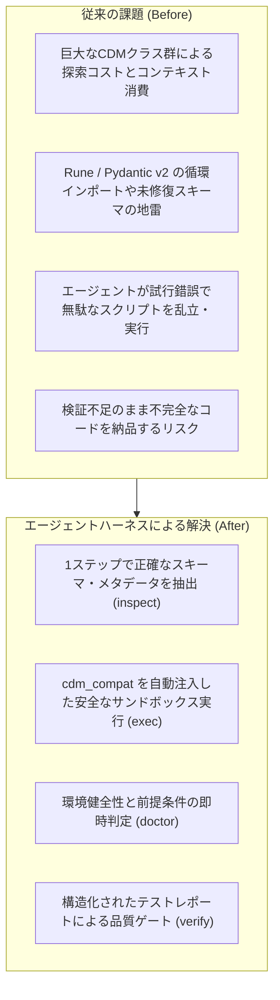
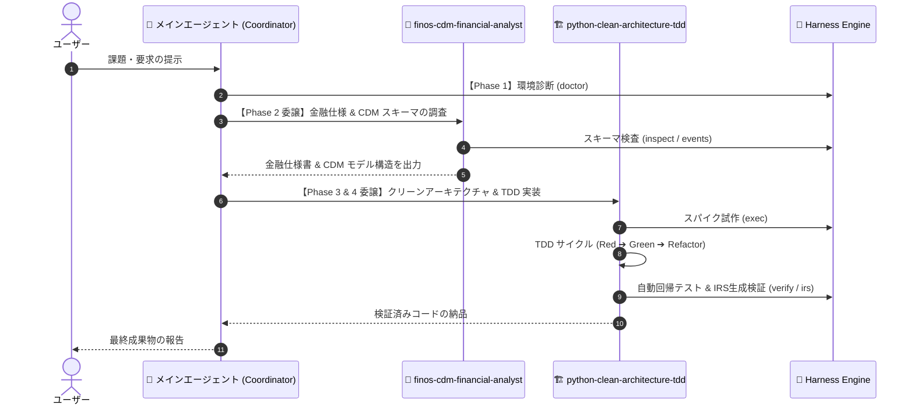

# AI エージェントハーネス (`src/cdm_workspace/harness`) 設計書 & 活用ガイド

本書は、`src/cdm_workspace/harness/` に実装されている **AI エージェントハーネス（Universal AI Agent Harness）** の設計目的、アーキテクチャ、および **メインエージェントと2つの専門サブエージェントによるタスク割り当て・活用フェーズ（メンタルモデルと使い方）** を解説するドキュメントです。

---

## 1. 🎯 設計目的 (Why it exists)

LLM（AI エージェント）による自律開発や FINOS CDM（Common Domain Model）を扱った金融システム開発には、以下のような特有の課題が存在します。



### ハーネスが解決する4つのコア目的:

1. **エージェントの「探索コスト」と「コンテキストウィンドウ消費」の最小化**:
   - FINOS CDM には数百のクラスと深い継承階層が存在します。エージェントがソースコードをファイル単位で網羅探索すると、大量のトークンと時間を浪費します。
   - ハーネスは、クラス名からフィールド一覧、型、必須/任意フラグ、基底クラスを**決定論的かつピンポイントに抽出**し、最小のトークンで正確なモデル仕様を提供します。

2. **CDM / Rune ランタイムの「環境依存地雷」の完全な抽象化と隠蔽**:
   - `finos-cdm` 7.1.0 と `rune-runtime` には、循環インポートや Pydantic v2 での継承フィールド欠落などの問題が存在します。
   - ハーネスは内部で `cdm_compat` 互換レイヤーを自動初期化するため、エージェントはランタイムのバグに悩まされることなく、純粋なドメイン設計に集中できます。

3. **Core（汎用基盤）と Plugin（ドメイン特化）の疎結合な設計**:
   - 環境診断やテスト実行、安全なコード実行などの汎用ロジック（`core.py`）と、CDM 特有のモデル検査やイベント一覧（`cdm_plugin.py`）を分離し、高い保守性と拡張性を実現しています。

4. **自律的検証ループ（OODA ループ）の支援**:
   - エージェントが「現状観察（`doctor`）➔ 仕様把握（`inspect` / `events`）➔ 試作（`exec`）➔ 検証（`verify` / `irs`）」という自律サイクルを迷わず完結できるようにします。

---

## 2. 🏛️ アーキテクチャとモジュール構成

`src/cdm_workspace/harness/` は、汎用的な実行エンジンと金融・CDM 専用のアダプターで構成されています。

```text
src/cdm_workspace/harness/
├── __init__.py      # パッケージ公開 API (doctor, verify, exec_code, inspect_model 等)
├── core.py          # [汎用基盤] 環境診断 (doctor), テスト検証 (verify), 安全実行 (exec_code), Context
├── cdm_plugin.py    # [CDM拡張] モデル検査 (inspect_model), イベント一覧, サンプルIRS生成
├── cli.py           # CLI コマンドディスパッチャー (argparse)
└── __main__.py      # python -m cdm_workspace.harness エントリポイント
```

| モジュール | 責務 | 主な提供関数 / クラス |
| :--- | :--- | :--- |
| **`core.py`** | ワークスペース実行環境の健全性管理、サブプロセスでの安全なコード実行、pytest テストスイートの実行と結果の構造化。 | `HarnessContext`, `get_context()`, `doctor()`, `verify()`, `exec_code()` |
| **`cdm_plugin.py`** | `finos._bundle` からのモデル動的検索、Pydantic v2 フィールドメタデータ解析、ISDA 取引ライフサイクルイベントの定義管理。 | `inspect_model()`, `list_business_events()`, `generate_irs_sample()` |
| **`cli.py`** | コマンドライン引数をパースし、人間および AI エージェントに読みやすいフォーマット済みテキストレポートを出力。 | `main()` |

---

## 3. 👥 エージェント体制とタスク割り当てマトリクス

本ワークスペースでは、**メインエージェント（オーケストレーター）** と **2つの専門サブエージェント** が協調して開発を進めます。ハーネスの各機能は、開発ライフサイクルのフェーズに応じて適切なエージェントに割り当てられます。



| 開発フェーズ | 担当エージェント | 役割・タスク内容 | 活用するハーネス機能 |
| :--- | :--- | :--- | :--- |
| **Phase 1: 環境健全性確認** | 🤖 **メインエージェント**<br>(Main Coordinator) | ・セッション開始時の前提条件チェック<br>・仮想環境（`.venv`）とパッチの健全性確認<br>・タスク全体の分解とサブエージェントへのディスパッチ | `doctor()`<br>`HarnessContext` |
| **Phase 2: モデル探索 & 仕様設計** | 🏦 **`finos-cdm-financial-analyst`**<br>(Quant & CDM Analyst) | ・金融工学理論（キャッシュフロー、デイカウント、カーブ）の確定<br>・ISDA ライフサイクルイベントの適格性確認<br>・CDM スキーマ（フィールド、型、必須フラグ）の調査とデータ階層設計 | `inspect_model()`<br>`list_business_events()` |
| **Phase 3: スパイク試作 & サンドボックス検証** | 🏗️ **`python-clean-architecture-tdd`**<br>(Python Architect & TDD Lead) | ・CDM クラスのインスタンス化やシリアライズの挙動確認<br>・Anti-Corruption Layer (ACL) の変換ロジックの動作検証 | `exec_code()` |
| **Phase 4: TDD 実装 & 品質ゲート** | 🏗️ **`python-clean-architecture-tdd`**<br>🤖 **メインエージェント** | ・Red（テスト先行作成）➔ Green（純粋ドメイン実装）➔ Refactor<br>・pytest 回帰テストの全件自動実行<br>・IRS JSON ラウンドトリップの完全性確認<br>・メインエージェントによる完了判定とユーザー報告 | `verify()`<br>`generate_irs_sample()` |

---

## 4. 🧠 各フェーズの詳細メンタルモデルと使い方

### Phase 1: セッション開始時の環境健全性確認 (Sanity Check)
* **主導**: 🤖 メインエージェント
* **利用コンポーネント**: `doctor()` / `HarnessContext`
* **エージェントの思考プロセス**:
  1. `doctor()` を実行して環境診断レポートを取得。
  2. `is_venv` が `True` か、`cdm_compat` が正常に初期化されているかを確認。
  3. 全項目が `[ OK ]` であれば安心して作業に着手し、`[FAIL]` があれば環境修正を最優先する。

---

### Phase 2: ドメイン設計・CDM スキーマの探索 (Schema Discovery)
* **主導**: 🏦 `finos-cdm-financial-analyst`
* **利用コンポーネント**: `inspect_model(model_name)` / `list_business_events()`
* **エージェントの思考プロセス**:
  1. `inspect_model("InterestRatePayout")` 等を実行し、フィールド一覧（`rateSpecification`, `payerReceiver` 等）と必須フラグを確認。
  2. フィールドが `FieldWithMeta...` でラップされているか、プリミティブ型かを把握。
  3. ソースファイルを何千行も開いて読むことなく、正確な仕様に基づいてドメインモデルや DTO を設計。

---

### Phase 3: スパイク検証 & 安全なコード試作 (Spike Prototyping)
* **主導**: 🏗️ `python-clean-architecture-tdd`
* **利用コンポーネント**: `exec_code(code_string, timeout=15)`
* **エージェントの思考プロセス**:
  1. `exec_code("from finos.cdm.base.datetime.PeriodEnum import PeriodEnum; print(PeriodEnum.M)")` のようにコード片を投げる。
  2. `cdm_compat` が自動インポートされたサブプロセスで実行され、標準出力・標準エラー・終了コードが返る。
  3. 構文や挙動の正しさを確認した上で、確信を持って本番コードの実装に移る。

---

### Phase 4: TDD サイクルの自動検証と品質ゲート (Automated Quality Gate)
* **主導**: 🏗️ `python-clean-architecture-tdd`（実行） / 🤖 メインエージェント（完了判断）
* **利用コンポーネント**: `verify(tests_path="tests")` / `generate_irs_sample()`
* **エージェントの思考プロセス**:
  1. `verify()` を実行し、構造化されたテスト結果（`ok`, `exit_code`, `elapsed_seconds`, `stdout`）を取得。
  2. 失敗したテストがある場合は、スタックトレースから原因を特定して Red ➔ Green ループへ戻る。
  3. `generate_irs_sample()` で実際の JSON ファイル出力とバリデーションを通過させ、タスク完了を自己証明する。

---

## 5. ⚙️ 「エージェント割り当て」を担保する設定構造

「各フェーズでどのエージェントが起動・委譲されるか」は、ハーネスコード単体ではなく、**Antigravity の階層型カスタマイズ設定** によって厳格に定義・担保されています。

```text
.agents/
├── agents/                       # 1. サブエージェントの定義（役割・実行権限・委譲フラグ）
│   ├── finos-cdm-financial-analyst.md    (role: Quant & CDM Analyst, subagent: true)
│   └── python-clean-architecture-tdd.md  (role: Python Architect, subagent: true)
├── rules/                        # 2. 不変の制約・コーディング規約（Do's & Don'ts）
│   ├── cdm-workspace.md
│   ├── financial-engineering-cdm.md
│   └── python-clean-architecture-tdd.md
└── skills/                       # 3. ハーネス操作の実行マニュアル（Runbooks）
    └── cdm-workspace/SKILL.md
AGENTS.md                         # 4. メインエージェントのオーケストレーション憲章
```

### 設定とハーネスの役割分担:

1. **エージェントの能力と役割宣言 (`.agents/agents/*.md`)**:
   - YAML Frontmatter で `subagent: true`, `role`, `description`, `commandExecutionPolicy: auto` を設定。
   - これにより、Antigravity は「金融や CDM 調査の依頼」を `finos-cdm-financial-analyst` に、「Python 実装やリファクタリングの依頼」を `python-clean-architecture-tdd` に正確にルーティングします。

2. **オーケストレーション方針の定義 (`AGENTS.md`)**:
   - メインエージェントがタスクを受けた際、まず環境健全性を確認し、次にアナリストに設計を委譲し、最後にアーキテクトに実装を委譲するという**協調シーケンス**を明記。

3. **ハーネス操作手順の提供 (`.agents/skills/cdm-workspace/SKILL.md`)**:
   - 各サブエージェントがハーネスの `doctor`, `inspect`, `verify` などを迷わず実行できるよう、Runbook 1〜5 として操作手順を定義。

4. **ハーネス実行基盤 (`src/cdm_workspace/harness/`)**:
   - 上記の設定に基づきエージェントから呼び出される「決定論的・安全・ステートレスな実行エンジン」として機能。

---

## 6. 💻 プログラム API としての利用方法 (Python Code)

ハーネスは CLI からの実行だけでなく、Python スクリプトやテストコード、他のツールから直接モジュールとしてインポートして利用できます。

```python
import cdm_compat  # 互換レイヤー
from cdm_workspace.harness import doctor, inspect_model, verify, exec_code

# 1. 環境診断の実行
diag = doctor()
if not diag["ok"]:
    print("環境に問題があります:", diag["report"])

# 2. モデル構造の辞書的取得 (プログラマティックにフィールドを調査)
model_info = inspect_model("Trade")
if model_info["found"]:
    print(f"Base classes: {model_info['bases']}")
    for field in model_info["fields"]:
        if field["required"]:
            print(f"Required field: {field['name']} ({field['type']})")

# 3. コードスニペットの安全実行
result = exec_code("from finos.cdm.base.math.UnitType import UnitType; print(UnitType)")
print("Snippet output:", result["stdout"])

# 4. テスト検証の実行
test_result = verify()
print(f"Tests passed: {test_result['ok']} (Time: {test_result['elapsed_seconds']:.2f}s)")
```

---

## 7. 📌 まとめ

`src/cdm_workspace/harness` は、単なるスクリプト群ではなく、**メインエージェントと2つの専門サブエージェントがそれぞれのフェーズで迷いなく高品質な意思決定と検証を行うための「統合認知・実行プラットフォーム」** です。
そのエージェント割り当ては、Antigravity の `.agents/agents/`、`AGENTS.md`、`.agents/rules/`、`.agents/skills/` の階層構造によって堅固に担保されています。
