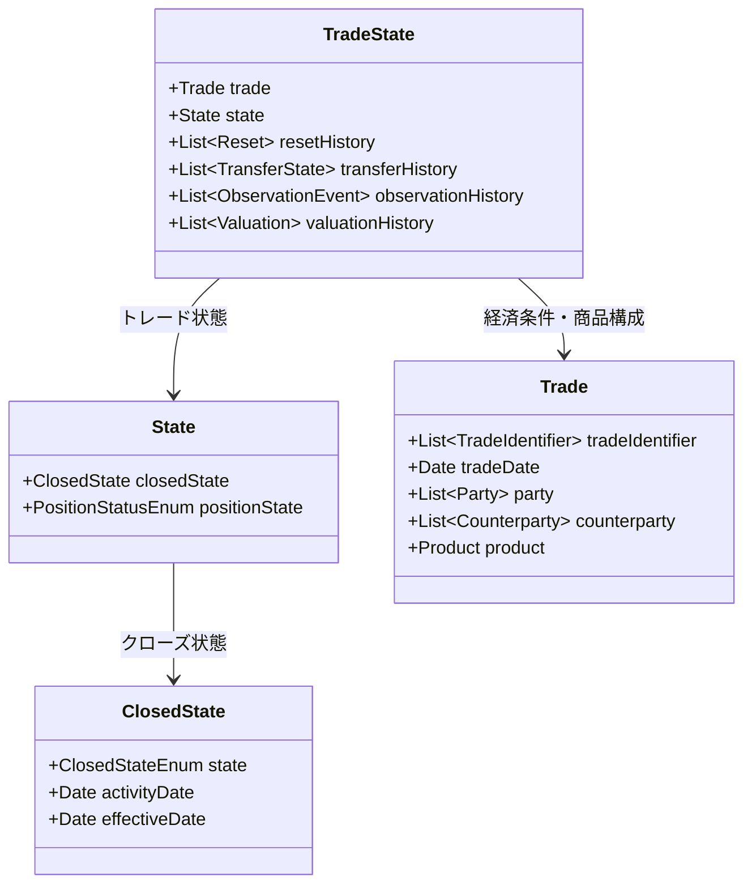
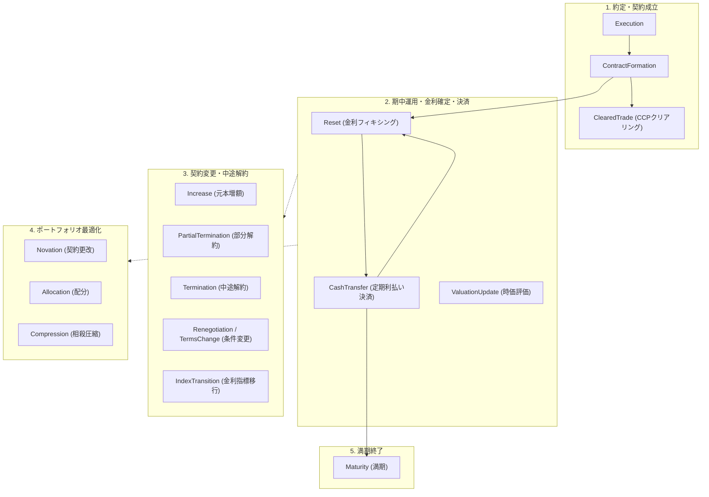

# FINOS CDM 金利スワップ（IRS）TradeState & ビジネスイベント仕様書

本文書は、FINOS CDM (Common Domain Model v7.1.0) における**プレーンな金利スワップ（Plain Vanilla Interest Rate Swap: IRS）**を対象とした `TradeState` のデータ構造と、実装・定義されている各種**ビジネスイベント（Business Event）**のライフサイクルおよびアーキテクチャについてまとめた技術ドキュメントです。

---

## 1. 背景と概要

FINOS CDM は、デリバティブや証券取引などの金融取引における商品定義だけでなく、取引のライフサイクル（発生、約定、決済、契約変更、終了）を一貫して追跡・処理するための**イベントモデル**を標準化しています。

金利スワップ取引（固定金利 vs. 変動金利、例: JPY Fixed vs. TONA OIS や USD SOFR OIS）において、CDM は取引の特定時点の状態を **`TradeState`** として保持し、金利リセット、利払い、中途解約、ノベーションなどの状態遷移を **`BusinessEvent`** としてモデル化します。

---

## 2. `TradeState` のアーキテクチャと構成要素

`TradeState` (`finos.cdm.event.common.TradeState`) は、1つの取引に関する経済条件と、その取引がこれまで辿ってきた履歴・現在のステータスを包括する中心的なオブジェクトです。

### 主要フィールドの役割

| フィールド名 | 型 | 説明 |
| :--- | :--- | :--- |
| **`trade`** | `Trade` | 取引の法的・経済的条件（固定/変動レグの `InterestRatePayout`、元本、当事者、UTI 等）。 |
| **`state`** | `State` | トレードの現在ステータス。終了している場合は `closedState`（`ClosedStateEnum`）に理由が記録される。 |
| **`resetHistory`** | `List[Reset]` | 変動金利（TONA, SOFR等）の基準金利リセット（Fixing）観測値および適用レートの累積履歴。 |
| **`transferHistory`** | `List[TransferState]` | 定期利払い（Netting決済含む）、アップフロント手数料、中途解約違約金などのキャッシュフロー決済履歴。 |
| **`observationHistory`** | `List[ObservationEvent]` | 市場レート等の観測イベント履歴。 |
| **`valuationHistory`** | `List[Valuation]` | スワップの時価評価（Mark-to-Market / NPV）の更新履歴。 |

### `ClosedStateEnum`（トレード終了ステータス）

取引が終了・移行した場合、`TradeState.state.closedState.state` に以下のいずれかの Enum 値が設定されます：

* **`ALLOCATED`**: ブロックトレードが子口座へ分割・配分されたことによる親取引の終了
* **`CANCELLED`**: 取引の取消・無効化
* **`EXERCISED`**: スワップションの権利行使（スワップション契約のクローズ）
* **`EXPIRED`**: 権利消滅
* **`MATURED`**: 満期日到来による通常終了
* **`NOVATED`**: ノベーション（契約上の地位譲渡）による旧契約の終了
* **`TERMINATED`**: 中途解約（アンワインド）やクリアリング移転による終了

---

## 3. 金利スワップ（IRS）で実装されているビジネスイベント一覧

プレーン金利スワップの全ライフサイクルにおいて、以下のビジネスイベント（および自動判定関数 `Qualify_*`）が定義・実装されています。

### ① 約定・契約成立フェーズ（Inception）

| イベント名 | Qualify 関数 | 概要・動作 | TradeState への影響 |
| :--- | :--- | :--- | :--- |
| **Execution** | `Qualify_Execution` | 取引の執行・合意の記録。 | 初期 `TradeState`（未確定契約）の生成 |
| **ContractFormation** | `Qualify_ContractFormation` | 執行された取引が法的拘束力を持つOTCデリバティブ契約として成立。 | 正式な `TradeState` として確定 |
| **ClearedTrade** / **OpenOfferClearedTrade** | `Qualify_ClearedTrade` / `Qualify_OpenOfferClearedTrade` | バイラテラルなスワップ取引を清算機関（JSCC, LCH等）に持ち込みクリアリング登録。 | 元取引（Alpha）が `closedState=TERMINATED` となり、CCPを相手方とする新 TradeState（Beta/Gamma）が2本生成 |

### ② 期中運用・金利確定・決済フェーズ（Post-Trade Processing）

| イベント名 | Qualify 関数 | 概要・動作 | TradeState への影響 |
| :--- | :--- | :--- | :--- |
| **Reset** | `Qualify_Reset` | 変動レグ（TONA, SOFR等）の基準金利の観測値（Fixing）確定。 | `resetHistory` および `observationHistory` にリセット値が追加され、次回利息計算レートが確定 |
| **CashTransfer** / **CashFlow** | `Qualify_CashTransfer` | 固定レグ利息および変動レグ利息の支払い、または差額ネッティング決済の実行。 | `transferHistory` に `TransferState` が追加 |
| **ValuationUpdate** | `Qualify_ValuationUpdate` | スワップの時価（Mark-to-Market）やNPV（正味現在価値）の更新。 | `valuationHistory` に評価額が追加 |

### ③ 契約内容変更・中途解約フェーズ（Amendments & Unwind）

| イベント名 | Qualify 関数 | 概要・動作 | TradeState への影響 |
| :--- | :--- | :--- | :--- |
| **Increase** | `Qualify_Increase` | 想定元本（Notional）の増額。 | `trade.tradeLot` の数量が増加 |
| **PartialTermination** | `Qualify_PartialTermination` | 想定元本の一部減額（部分解約）および解約金（Unwind Fee）の授受。 | 元本数量が減額され、`transferHistory` に解約精算金が追加 |
| **Termination** / **Cancellation** | `Qualify_Termination` / `Qualify_Cancellation` | スワップ取引の早期一括解約（フルアンワインド）。 | `state.closedState` が `TERMINATED` または `CANCELLED` に遷移 |
| **Renegotiation** / **TermsChange** | `Qualify_Renegotiation` | 固定利率（Fixed Rate）、満期日（TerminationDate）、支払周期などの条件変更。 | `trade` 内の `EconomicTerms` や `Payout` の定義が変更 |
| **IndexTransition** | `Qualify_IndexTransition` | 基準金利の移行（例: LIBORからTONA/SOFRへの移行、ISDAフォールバックスプレッド調整値の適用）。 | 変動レグの `FloatingRateIndex` やスプレッド調整値が更新 |

### ④ 相手方変更・ポートフォリオ最適化フェーズ（Portfolio Management）

| イベント名 | Qualify 関数 | 概要・動作 | TradeState への影響 |
| :--- | :--- | :--- | :--- |
| **Novation** / **PartialNovation** | `Qualify_Novation` / `Qualify_PartialNovation` | スワップ契約の片方の当事者が第三者に契約上の地位を譲渡（契約更改）。 | 旧契約の `closedState` が `NOVATED` になり、新相手方との新規 `TradeState` が生成 |
| **Allocation** / **Reallocation** | `Qualify_Allocation` / `Qualify_Reallocation` | 資産運用会社等のブロックトレードを個別ファンド・サブ口座へ分割配分。 | 親 TradeState は `closedState=ALLOCATED` となり、配分先ごとの子 TradeState 群が生成 |
| **Compression** | `Qualify_Compression` | 同一通貨・同一条件等の複数スワップを相殺し、ポジション本数と総元本を圧縮。 | 対象となった複数 TradeState が `TERMINATED` となり、集約された新 TradeState に統合 |

### ⑤ 満期終了フェーズ（Maturity）

| イベント名 | Qualify 関数 | 概要・動作 | TradeState への影響 |
| :--- | :--- | :--- | :--- |
| **Maturity** | （計算期間満了） | 最終計算期間の満了および最終利払い完了による契約終了。 | `state.closedState` が `MATURED` に遷移 |

---

## 4. CDM イベントモデルの設計思想（Primitive と BusinessEvent）

CDM では、金融業界の多様なイベントをハードコーディングするのではなく、**直交する少数の基本要素（Primitive Instruction）**の組み合わせとしてモデル化しています。

### Primitive Instruction（基本操作）

| プリミティブ名 | 役割 | 金利スワップでの適用例 |
| :--- | :--- | :--- |
| **`contractFormation`** | 契約の生成・法的一体化 | 取引成立時の Trade 生成 |
| **`execution`** | 執行の記録 | 約定データの生成 |
| **`reset`** | 観測値・レートの確定 | TONA/SOFRの金利フィキシング |
| **`transfer`** | 資金や資産の移動 | 固定/変動利払い、解約違約金、手数料 |
| **`quantityChange`** | 数量（元本）の増減 | 元本増額、部分解約、中途解約（0への減額） |
| **`termsChange`** | 契約条件の変更 | 固定金利の変更、満期日の延長 |
| **`partyChange`** | 当事者の変更・置換 | ノベーション（譲渡先への相手方差替） |
| **`split`** | 取引の分割 | アロケーション、ブロック取引の分割 |
| **`indexTransition`** | 指標の移行 | LIBOR移行（スプレッド調整値適用） |
| **`valuation`** | 評価額の更新 | 時価評価（Mark-to-Market） |

### イベント判定（Qualification）の流れ

1. `BusinessEvent` に **`before: TradeState`** と **`instruction`（`PrimitiveInstruction` を内包）** が渡される。
2. 状態遷移計算により **`after: List[TradeState]`** が導出される。
3. CDM の **`Qualify_*` 関数群**（例: `Qualify_Reset`, `Qualify_CashTransfer`, `Qualify_Termination`）が実行され、イベントの種別（`eventQualifier`）が自動判定される。

---

## 5. 代表的なイベントシナリオと TradeState 遷移例

### シナリオ 1: 変動金利のリセット（Reset / Rate Fixing）

* **発生タイミング**: 利払い計算期間の開始日または基準金利決定日
* **構成プリミティブ**: `PrimitiveInstruction(reset=ResetInstruction(...))`
* **TradeState の変化**:
  * `before.trade` と同一の `after.trade`
  * `after.resetHistory` に新しいレート（例: 0.25%）と観測日を持つ `Reset` オブジェクトが追記される。

### シナリオ 2: 定期利払い決済（CashTransfer / CashFlow）

* **発生タイミング**: 各利払い期日（Payment Date）
* **構成プリミティブ**: `PrimitiveInstruction(transfer=TransferInstruction(...))`
* **TradeState の変化**:
  * 固定レグ支払額（例: 750万円）と変動レグ支払額（例: 250万円）のネット差額（例: 500万円）の `Transfer` が生成。
  * `after.transferHistory` に `TransferState(status=SETTLED)` が記録される。

### シナリオ 3: 中途全額解約（Full Termination / Unwind）

* **発生タイミング**: 取引期間中の早期解約合意時
* **構成プリミティブ**: `quantityChange`（想定元本を 0 に変更） ＋ `transfer`（中途解約清算金）
* **TradeState の変化**:
  * `after.state.closedState.state` が `ClosedStateEnum.TERMINATED` に設定。
  * 以降の利払い・リセットイベントの対象から除外される。

### シナリオ 4: ノベーション（Novation）

* **発生タイミング**: 片方の取引相手（Party A）が保有ポジションを新当事者（Party C）に譲渡
* **構成プリミティブ**: `partyChange`（Party A を Party C に置換） ＋ `transfer`（ノベーション手数料）
* **TradeState の変化**:
  * **旧 TradeState (Before)**: `state.closedState.state = NOVATED` に遷移し、クローズ。
  * **新 TradeState (After)**: Party C と Party B の間で同一の経済条件を持つ新規 TradeState が生成。

---

## 6. まとめ

FINOS CDM は、プレーンな金利スワップの単なる静的データフォーマットにとどまらず、**約定から清算、金利フィキシング、利払い決済、契約変更、ノベーション、満期・中途解約までの全ライフサイクルイベントを網羅的に表現・処理できる堅牢なイベント駆動型アーキテクチャ**を提供しています。

本ワークスペースで生成される `irs_trade.json` などの `Trade` オブジェクトは、初期の `TradeState` としてラップされ、上記に定義されたすべてのビジネスイベントの基点としてシームレスに連携・処理することが可能です。
